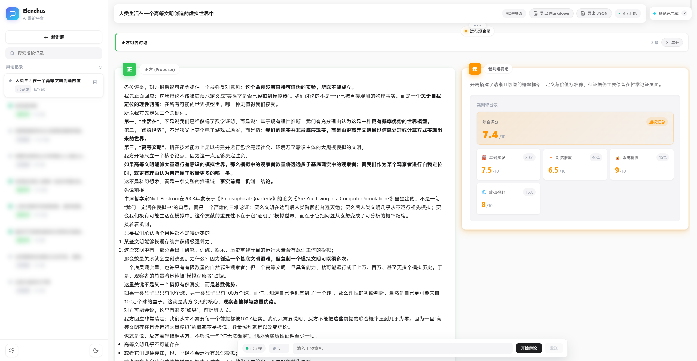

# Elenchus

Elenchus 是一个用于多智能体辩论的平台，基于 `FastAPI + LangGraph + React 19` 构建，支持多事件回放、会话资料池，以及面向不同目标的独立辩论模式。

本项目完全由AI实现，感谢 [Linux Do](https://linux.do/) 热心佬友和OAI大善人的支持❤️。

本项目建立的初衷是提升使用者的思辨能力和交流水平。

## 核心特性

- **标准辩论模式**：常规辩论流程，拥有裁判评分，调用搜索工具等能力。
- **诡辩模式**：独立的实验模式，在此模式下辩手将尽可能使用诡辩手法进行对抗。
- **实时流式输出**：通过 WebSocket 推送发言、状态、时间线与运行图事件。
- **回放与恢复**：基于运行时事件与会话快照恢复历史过程。
- **会话资料池**：支持上传参考资料，并由独立Agent总结后汇入会话公共资料池。

## 快速启动

双击exe文件即可启动。

前端启动后请在左下角配置自定义模型提供商。

## 示例辩论记录

`examples/` 目录提供了若干导出的中文辩论记录示例，便于快速了解系统的实际输出效果。

默认地址：

- 前端：`http://localhost:5173`
- 后端：`http://localhost:8001`

首次使用时，打开 Web UI 后需要先在模型配置中添加可用的 provider。

更完整的启动与联调说明见：[docs/getting-started.md](./docs/getting-started.md)

## 文档导航

- [文档首页](./docs/README.md)
- [快速开始](./docs/getting-started.md)
- [系统架构总览](./docs/architecture.md)
- [运行时与回放](./docs/runtime.md)
- [诡辩实验模式说明](./docs/sophistry-experiment-mode-design.md)
- [后端开发指南](./docs/guides/backend-development.md)
- [前端开发指南](./docs/guides/frontend-development.md)

## 项目结构概览

- `frontend/`：React + Vite 前端，负责创建会话、实时观察、聊天与回放界面。
- `backend/`：FastAPI + LangGraph 后端，负责运行编排、API、会话存储与事件流。
- `docs/`：详细文档入口，包括架构、运行时、模式与开发指南。
- `runtime/`：本地运行时生成内容，包括数据库、日志、会话快照与事件文件。

如果你只是第一次了解这个项目，先读本页；如果你准备开发或排查问题，请从 [docs/README.md](./docs/README.md) 进入详细文档。
