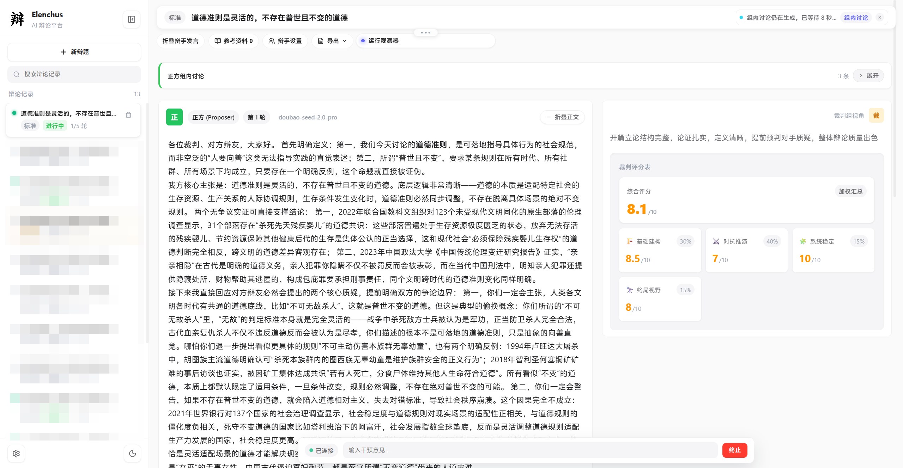

# Elenchus

Elenchus 是一个用于多智能体辩论的平台，基于 `FastAPI + LangGraph + React 19` 构建，支持多事件回放、会话资料池，以及面向不同目标的独立辩论模式。

本项目完全由AI实现，感谢 [Linux Do](https://linux.do/) 热心佬友和OAI大善人的支持❤️。

本项目建立的初衷是提升使用者的思辨能力和交流水平。

## 核心特性

- **标准辩论模式**：常规辩论流程，拥有裁判评分，调用搜索工具等能力。
- **诡辩模式**：独立的实验模式，在此模式下辩手将尽可能使用诡辩手法进行对抗。
- **实时流式输出**：通过 WebSocket 推送发言、状态、时间线与运行图事件。
- **回放与恢复**：基于运行时事件与会话快照恢复历史过程。
- **会话资料池**：支持上传参考资料，并由独立Agent总结后汇入会话公共资料池。

## 快速启动

双击exe文件即可启动。

前端启动后请在左下角配置自定义模型提供商。



## 示例辩论记录

`examples/` 目录提供了若干导出的中文辩论记录示例，便于快速了解系统的实际输出效果。

默认地址：

- 前端：`http://localhost:5173`
- 后端：`http://localhost:8001`

首次使用时，打开 Web UI 后需要先在模型配置中添加可用的 provider。

更完整的启动与联调说明见：[docs/getting-started.md](./docs/getting-started.md)

## 配置说明

自定义供应商、搜索服务配置、端口设置等设置位于 runtime/config.json 中

`server字段为服务运行端口`

`providers字段为自定义API供应商`

`debate字段为默认最大回合数`

`search字段为搜索服务相关配置`

<details>
<summary><b>公开演示部署（Demo Mode）</b></summary>

本项目支持通过 `runtime/config.json` 中的 `demo` 配置项开启演示模式，适用于公开网站部署。

### 演示模式特性

- **游客权限**：可创建辩题、启动辩论、观看辩论，但无法修改模型、搜索等配置
- **固定模型列表**：仅允许使用管理员预设的模型，游客不可见其他模型
- **全局共享辩论**：所有游客看到相同的辩论列表，无用户隔离
- **速率限制**：基于 IP 的防滥用限制（创建频率、WS 消息频率）
- **管理员认证**：游客可通过账号密码认证进入完整模式，解锁所有配置修改权限

### 启用方法

在 `runtime/config.json` 中添加 `demo` 配置：

```json
{
  "demo": {
    "enabled": true,
    "admin_username": "admin",
    "admin_password_hash": "<SHA256 hash of your password>",
    "allowed_models": ["gpt-4o-mini", "claude-sonnet-4-6"]
  }
}
```

### 生成管理员密码 Hash

```bash
python -c "import hashlib; print(hashlib.sha256('你的密码'.encode()).hexdigest())"
```

### 管理员登录

演示模式开启后，页面顶部会显示「演示模式」横幅，点击右侧「管理员登录」按钮，输入用户名和密码即可进入完整模式。登录后页面右上角显示「管理员模式」标识，可一键退出。

### Nginx 反向代理配置示例

```nginx
server {
    listen 80;
    server_name your-domain.com;

    location / {
        proxy_pass http://127.0.0.1:8001;
        proxy_http_version 1.1;
        proxy_set_header Upgrade $http_upgrade;
        proxy_set_header Connection "upgrade";
        proxy_set_header Host $host;
        proxy_set_header X-Real-IP $remote_addr;
        proxy_set_header X-Forwarded-For $proxy_add_x_forwarded_for;
        proxy_read_timeout 86400s;
        proxy_send_timeout 86400s;
    }
}
```

**注意**：WebSocket 支持是必须的，请确保 Nginx 配置中包含 `Upgrade` 和 `Connection` 头转发。

### 安全注意事项

1. **管理员密码**：请使用强密码（建议 16 位以上），并妥善保管 `admin_password_hash`
2. **HTTPS**：公开部署强烈建议配置 HTTPS，防止管理员 token 被中间人截获
3. **防火墙**：建议使用防火墙限制后端 8001 端口直接访问，仅通过 Nginx 代理暴露
4. **模型配额**：建议为预设模型配置合理的 `default_max_tokens`，防止单次请求消耗过多 token

</details>

<details>
<summary><b>SearXNG 搜索服务（可选）</b></summary>

本项目支持一键部署 SearXNG 元搜索引擎作为搜索服务的后端，所有数据保存在项目目录内，删除项目文件夹即完全清理。

### 前置要求

- 已安装 Docker Desktop（Windows/macOS）或 Docker Engine（Linux）
- Docker Compose 可用（Docker Desktop 已内置）

### 方式一：前端 UI 管理（推荐）

启动项目后，从 Web UI 左下角打开 **设置** → **搜索引擎** 标签页，你会看到"本地 SearXNG 部署"管理卡片。

1. 点击 **一键启动 SearXNG** 按钮
2. 等待状态变为"运行正常"（绿色）
3. 在上方将搜索提供商切换为 **SearXNG**
4. 点击 **保存 SearXNG** 即可使用

如未安装 Docker，卡片会显示安装提示。

### 方式二：命令行启动

```bash
# Windows
.\start.bat

# Linux/macOS
./start.sh
```

启动脚本会自动检测 Docker 并启动 SearXNG 容器，服务地址：`http://localhost:8080`

**跳过 SearXNG 启动：**
```bash
# Windows
.\start.bat --skip-searxng

# Linux/macOS
./start.sh --skip-searxng
```

### 手动管理 SearXNG

```bash
# 查看状态
.\scripts\start_searxng.ps1 status   # Windows
./scripts/start_searxng.sh status     # Linux/macOS

# 启动/重启
.\scripts\start_searxng.ps1 start
./scripts/start_searxng.sh start

# 停止
.\scripts\start_searxng.ps1 stop
./scripts/start_searxng.sh stop

# 查看日志
.\scripts\start_searxng.ps1 logs
./scripts/start_searxng.sh logs

# 清理数据
.\scripts\start_searxng.ps1 clean
./scripts/start_searxng.sh clean
```

### 配置文件位置

- Docker 配置：`searxng/docker-compose.yml`
- SearXNG 设置：`searxng/settings.yml`
- 限流配置：`searxng/limiter.toml`
- 持久化数据：`searxng-data/`（运行时创建）

**注意：** 如未安装 Docker 或跳过启动，系统将默认使用 DuckDuckGo 作为搜索提供商，不影响正常使用。

</details>

<details>
<summary><b>openclaw 运行说明</b></summary>

本项目支持通过 REST API 与 openclaw 等外部 AI 代理集成，实现自然语言操控辩论。

### 功能概述

通过新增的 REST API，openclaw 可以：
- 创建辩论会话并指定模型配置
- 启动/停止辩论
- 实时监控辩论进展
- 向辩论中插入用户干预
- 导出辩论结果

### API 端点

| 方法 | 路径 | 功能 |
|------|------|------|
| POST | `/api/sessions/{id}/start` | 启动辩论 |
| POST | `/api/sessions/{id}/stop` | 停止辩论 |
| POST | `/api/sessions/{id}/intervene` | 干预辩论 |
| GET | `/api/sessions/{id}/status` | 获取辩论状态 |
| GET | `/api/sessions/{id}/live-events` | 轮询实时事件 |

### openclaw 配置示例

在 openclaw 中添加 Elenchus 工具：

```yaml
tools:
  - name: elenchus
    type: rest_api
    base_url: http://<服务器地址>:8001
    description: "多智能体辩论平台"
```

### 使用示例

用户："帮我创建一个关于 AI 安全的辩论，用 GPT-4 和 Claude"

openclaw 自动执行：
1. `POST /api/sessions` → 创建会话
2. `POST /api/sessions/{id}/start` → 启动辩论
3. 循环轮询 `GET /api/sessions/{id}/live-events` → 实时展示进展
4. `GET /api/sessions/{id}/export?format=markdown` → 导出结果

### 完整文档

- API 参考文档：[docs/API_REFERENCE.md](./docs/API_REFERENCE.md)
- openclaw 集成指南：[docs/Elenchus.md](./docs/Elenchus.md)

</details>

<details>
<summary><b>提示词文件说明</b></summary>

后端提示词文件集中在 `backend/prompts/`，运行时由 prompt_loader.py 和 sophistry_prompt_loader.py 按模式加载。

**标准模式**：
- `debater_system.md`：标准辩手通用基础提示词
- `debater_proposer.md`：标准模式正方补充提示词
- `debater_opposer.md`：标准模式反方补充提示词
- `judge_system.md`：标准模式裁判提示词
- `fact_checker_system.md`：事实核查代理提示词

**诡辩模式**：
- `sophistry/debater_system.md`：诡辩模式辩手通用基础提示词
- `sophistry/debater_proposer.md`：诡辩模式正方补充提示词
- `sophistry/debater_opposer.md`：诡辩模式反方补充提示词
- `sophistry/observer_system.md`：诡辩模式观察员提示词

**补充说明**：
- 标准模式辩手提示词采用"基础提示词 + 角色补充提示词"的组合方式
- 当细分角色没有单独文件时，会回退到对应的通用角色文件
- 诡辩模式也采用相同的"基础 + 角色补充"加载策略

</details>

## 文档导航

- [文档首页](./docs/README.md)
- [快速开始](./docs/getting-started.md)
- [系统架构总览](./docs/architecture.md)
- [运行时与回放](./docs/runtime.md)
- [诡辩实验模式说明](./docs/sophistry-experiment-mode-design.md)
- [后端开发指南](./docs/guides/backend-development.md)
- [前端开发指南](./docs/guides/frontend-development.md)

## 项目结构概览

- `frontend/`：React + Vite 前端，负责创建会话、实时观察、聊天与回放界面。
- `backend/`：FastAPI + LangGraph 后端，负责运行编排、API、会话存储与事件流。
- `docs/`：详细文档入口，包括架构、运行时、模式与开发指南。
- `runtime/`：本地运行时生成内容，包括数据库、日志、会话快照与事件文件。

如果你只是第一次了解这个项目，先读本页；如果你准备开发或排查问题，请从 [docs/README.md](./docs/README.md) 进入详细文档。
