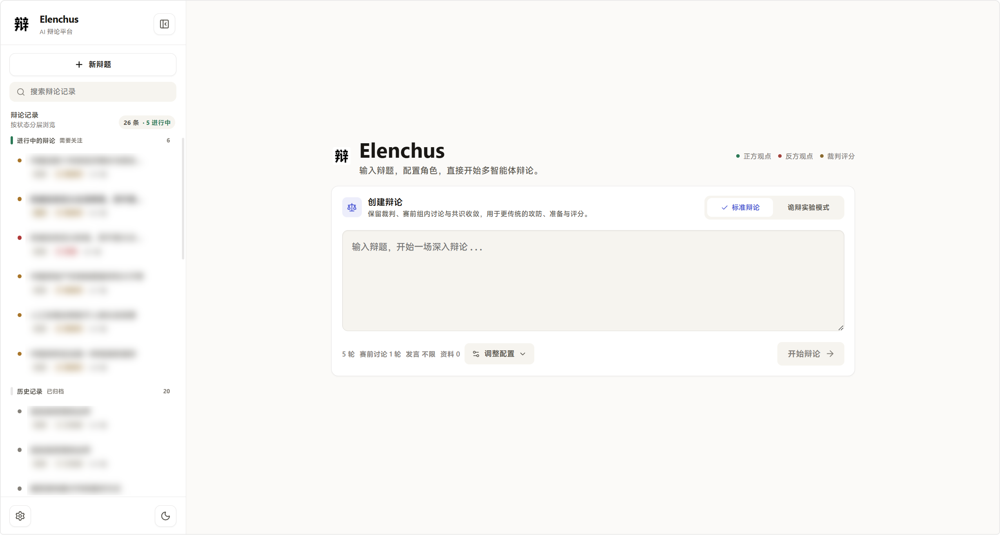

  

<h1>Elenchus</h1>

一个面向思辨训练的 AI 多智能体辩论平台。

    
    
    
    
    
    
  

本项目大部分由 AI 实现，感谢 [Linux Do](https://linux.do/) 和各家模型厂商的支持 ❤️。

输入辩题后，系统会组织正方、反方、裁判、观察员等多个 AI 角色展开辩论，并实时展示、保存、恢复和导出整场过程。

## 核心特性

- 标准辩论：正反方交锋、裁判评分，必要时调用搜索核实事实。
- 诡辩实验模式：辩手刻意使用谬误与修辞操控，观察员逐条分析。
- 实时输出：通过 WebSocket 实时呈现各角色发言与运行状态。
- 历史恢复：会话与运行过程保存为快照，随时恢复复盘。
- 参考资料：上传文本资料，作为整场辩论的公共背景知识。
- 视频生成：把辩论记录渲染成带配音和字幕的 MP4（附属工具），[使用说明](./docs/getting-started.md#6-使用视频生成器附属工具)。

`examples/` 目录提供若干导出的中文辩论记录示例，可快速了解实际输出效果。

## 快速开始

- Windows：运行 `start.bat`（或 `start.ps1`）；使用已发布 exe 的直接双击即可。
- macOS / Linux：运行 `./start.sh`。

首次启动时，在 Web 界面左下角配置自定义模型提供商。

完整启动步骤、默认地址与联调说明见 [docs/getting-started.md](./docs/getting-started.md)。

## 项目结构

- `frontend/`：React + Vite 前端，负责创建会话、实时观察、聊天与历史恢复界面。
- `backend/`：FastAPI + LangGraph 后端，负责运行编排、API、会话存储与事件流。
- `video/`：附属视频生成器，把辩论记录渲染成带配音的 MP4（独立 Node 工具链）。
- `docs/`：详细文档入口，包括架构、运行时、模式与开发指南。
- `runtime/`：本地运行时生成内容，包括数据库、日志、会话快照与事件文件。

## 文档导航

全部文档索引见 [docs/README.md](./docs/README.md)，按需直达：

- [快速开始](./docs/getting-started.md)：启动、配置与联调
- [系统架构总览](./docs/architecture.md)
- [运行时与历史恢复](./docs/runtime.md)
- [诡辩实验模式说明](./docs/sophistry-experiment-mode-design.md)
- [开发指南](./docs/development.md)
- [CI 失败排查清单](./docs/ci-troubleshooting.md)

## 许可证

[MIT](./LICENSE)
