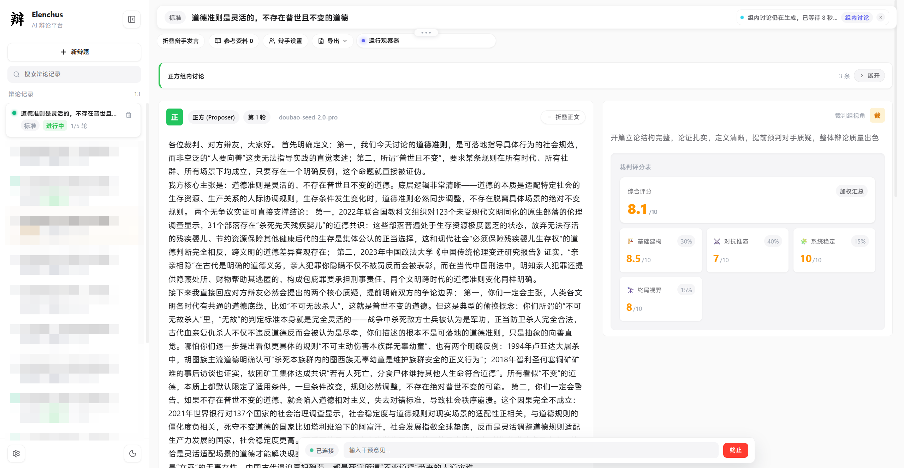

<div align="center">
  

<h1>Elenchus</h1>

<p>一个面向思辨训练的 AI 多智能体辩论平台。</p>

<p>输入辩题后，系统会组织正方、反方、裁判、观察员等多个 AI 角色展开辩论，并实时展示、保存、恢复和导出整场过程。</p>

<p>
    <a href="https://github.com/Piracola/Elenchus/actions/workflows/ci.yml"></a>
    <a href="https://github.com/Piracola/Elenchus/actions/workflows/build-portable-release.yml"></a>
    <a href="https://github.com/Piracola/Elenchus/releases"></a>
    
    
    
  </p>
</div>

本项目完全由 AI 实现，感谢 [Linux Do](https://linux.do/) 和各家大善人的支持 ❤️。

本项目的核心原理是：高质量的输入会让模型产生高质量的输入结果。

## 核心特性

- 标准辩论：正反方交锋，裁判评分，必要时可以调用搜索。
- 诡辩实验模式：让辩手故意使用诡辩/修辞操控，然后由观察员分析用了哪些谬误。
- 实时输出：前端通过 WebSocket 接收 AI 发言、状态和运行事件。
- 历史恢复：保存会话快照和运行事件，之后可以恢复历史过程。
- 参考资料：用户可以上传文本资料，系统会作为当前辩论的公共背景知识。

## 快速启动

双击exe文件即可启动。

前端启动后请在左下角配置自定义模型提供商。

构建流程会在前端构建阶段自动从根目录的 `Elenchus.png` 生成 favicon、`apple-touch-icon` 和 Windows 发布包使用的 `.ico` 图标文件，GitHub CI 产物也会同步使用这套新图标。



## 示例辩论记录

`examples/` 目录提供了若干导出的中文辩论记录示例，便于快速了解系统的实际输出效果。

默认地址：

- 前端：`http://127.0.0.1:5173`
- 后端：`http://localhost:8001`

首次使用时，打开 Web UI 后需要先在模型配置中添加可用的 provider。

更完整的启动与联调说明见：[docs/getting-started.md](./docs/getting-started.md)

## 配置说明

自定义供应商、搜索服务配置、端口设置等设置位于 runtime/config.json 中

`server字段为服务运行端口`

`providers字段为自定义API供应商`

`debate字段为默认最大回合数`

`search字段为搜索服务相关配置`

<details>
<summary><b>Provider API Key 加密</b></summary>

`runtime/config.json` 中的 Provider API Key 支持透明加密存储。启用方法：

```bash
# 生成加密密钥（仅需执行一次，妥善保存）
python -c "from cryptography.fernet import Fernet; print(Fernet.generate_key().decode())"

# 设置为环境变量
export ELENCHUS_ENCRYPTION_KEY="<上面生成的密钥>"
```

设置后，系统会在写入 `runtime/config.json` 时自动加密所有 `api_key`，读取时自动解密。未设置加密密钥时，API Key 仍以明文存储（向后兼容，但会发出警告）。

</details>

<details>
<summary><b>搜索服务说明</b></summary>

当前项目内置 `DDGS` 作为默认轻量搜索提供商，无需 Docker、无需单独服务、也无需额外部署步骤。

如果你希望接入外部搜索 API，可以在 **设置** → **搜索引擎** 中配置一个自定义 HTTP 搜索接口。

**注意：** 默认情况下系统会优先使用 `DDGS`。自定义接口未配置或不可用时，系统会回退到 DDGS。

</details>

<details>
<summary><b>提示词文件说明</b></summary>

后端提示词文件集中在 `backend/prompts/`，运行时由 prompt_loader.py 和 sophistry_prompt_loader.py 按模式加载。

**标准模式**：

- `debater_system.md`：标准辩手通用基础提示词
- `debater_proposer.md`：标准模式正方补充提示词
- `debater_opposer.md`：标准模式反方补充提示词
- `judge_system.md`：标准模式裁判提示词
- `fact_checker_system.md`：事实核查代理提示词

**诡辩模式**：

- `sophistry/debater_system.md`：诡辩模式辩手通用基础提示词
- `sophistry/debater_proposer.md`：诡辩模式正方补充提示词
- `sophistry/debater_opposer.md`：诡辩模式反方补充提示词
- `sophistry/observer_system.md`：诡辩模式观察员提示词

**补充说明**：

- 标准模式辩手提示词采用"基础提示词 + 角色补充提示词"的组合方式
- 当细分角色没有单独文件时，会回退到对应的通用角色文件
- 诡辩模式也采用相同的"基础 + 角色补充"加载策略

</details>

## 文档导航

- [文档首页](./docs/README.md)
- [快速开始](./docs/getting-started.md)
- [系统架构总览](./docs/architecture.md)
- [运行时与历史恢复](./docs/runtime.md)
- [诡辩实验模式说明](./docs/sophistry-experiment-mode-design.md)
- [开发指南](./docs/development.md)

## 项目结构概览

- `frontend/`：React + Vite 前端，负责创建会话、实时观察、聊天与历史恢复界面。
- `backend/`：FastAPI + LangGraph 后端，负责运行编排、API、会话存储与事件流。
- `docs/`：详细文档入口，包括架构、运行时、模式与开发指南。
- `runtime/`：本地运行时生成内容，包括数据库、日志、会话快照与事件文件。

如果你只是第一次了解这个项目，先读本页；如果你准备开发或排查问题，请从 [docs/README.md](./docs/README.md) 进入详细文档。
